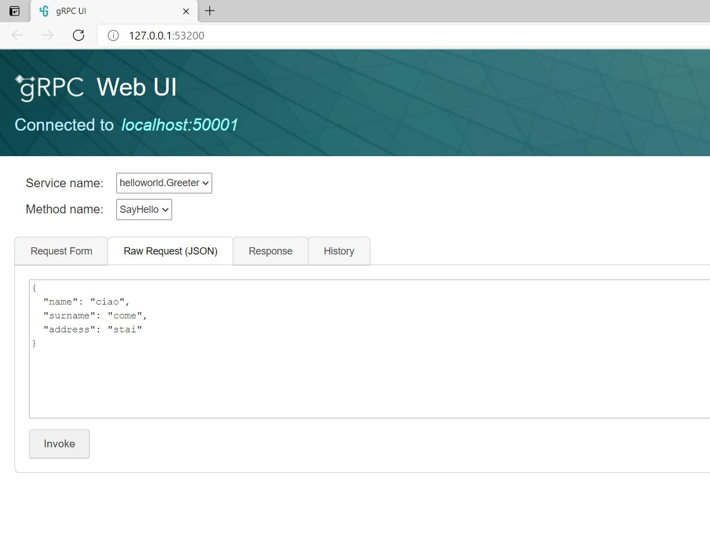

# net-grpc

The solution provides intro gRPC application for .NET Core 5.0.

Xamarin project deosn't work.

## Protocol buffer

[language guide - proto3](https://developers.google.com/protocol-buffers/docs/proto3)

### Request and response message

The **CalculateSize** function calculates the size of the message in Protocol Buffer wire format, in bytes.

Encoding and decoding is not so easy ([encoding](https://developers.google.com/protocol-buffers/docs/encoding)).

But for the message:
```
message HelloRequest {
  string name = 1;          // tag needs 1 byte when in range 1-15
  string surname = 2;       // tag needs 1 byte
  string address = 16;      // tag needs 2 bytes when in range 16-2047
}
```
when *name*='Console-1' and *surname*='abcdefg' and *address*='aaaa' the size is 27:
- 1 (tag) + 1 (name length)    + 9 (name)
- 1 (tag) + 1 (surname length) + 7 (surname)
- 2 (tag) + 1 (address length) + 4 (address)
where **tag** helds *key value* + *data type*

## gRPCurl

Tooling is available for gRPC that allows developers to test services without building client apps ([doc](https://docs.microsoft.com/en-us/aspnet/core/grpc/test-tools?view=aspnetcore-5.0)):
- **gRPCurl** is a command-line tool that provides interaction with gRPC services
- **gRPCui** builds on top of gRPCurl and adds an interactive web UI for gRPC, similar to tools such as Postman and Swagger UI

### Run gRPCui

When the gRPC server (supporting reflection) is running, run *grpcui* with the server address to interact with as an argument:
```
$ grpcui -plaintext localhost:50001
```
The tool launches a browser window with the interactive web UI. gRPC services are automatically discovered using gRPC reflection.

Request:


Response:
